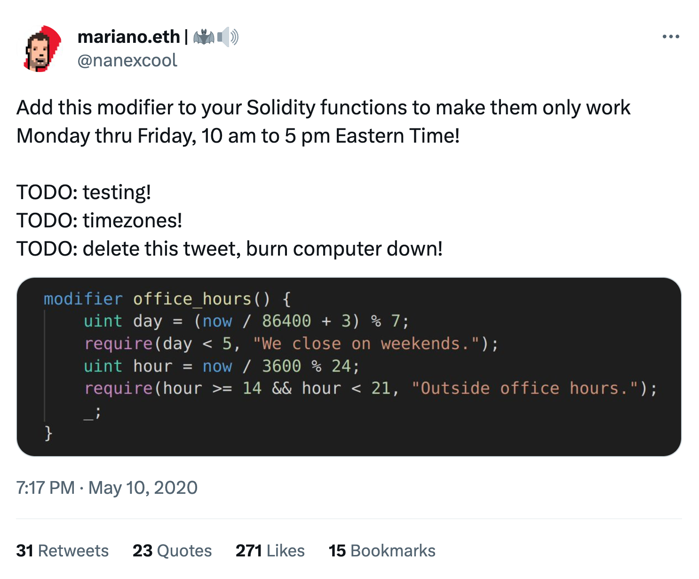

# 🗽 trading-days

A Uniswap v4 hook that reverts when markets are closed in New York.

## Views

- `isCoreTradingHours`: Return `true` between 9:30 AM and 4:00 PM ET.
- `isTradingDay`: Return `true` Mon-Fri, if it's not a NYSE holiday.
- `isHoliday`: Return `true` if it's a NYSE holiday.
- `getHoliday`: Get the current holiday (see the `Holiday` enum).
- `isDST`: Return `true` if it's Daylight Savings Time in New York.
- `time`: Adjust `block.timestamp` to US Eastern Time.
- `marketIsOpen`: Return `true` if the market is currently open.
- `state`: Get the current state of the market, one of:
  - `HOLIDAY`
  - `WEEKEND`
  - `AFTER_HOURS`
  - `OPEN`

## Errors

- `ClosedForHoliday(Holiday holiday)`: Markets are closed for a NYSE holiday. This error includes a Holiday enum, one of:
  - `NEW_YEARS_DAY`
  - `MARTIN_LUTHER_KING_JR_DAY`
  - `WASHINGTONS_BIRTHDAY`
  - `GOOD_FRIDAY`
  - `MEMORIAL_DAY`
  - `JUNETEENTH_NATIONAL_INDEPENDENCE_DAY`
  - `INDEPENDENCE_DAY`
  - `LABOR_DAY`
  - `THANKSGIVING_DAY`
  - `CHRISTMAS_DAY`
  - `NEW_YEARS_DAY_OBSERVED`
- `ClosedForWeekend`: Markets are closed for the weekend.
- `AfterHours`: Markets are closed weekdays between 9:30 AM and 4:00 PM ET.

## Events

- `DingDingDing`: If you perform the first swap of the day, you get to ring the opening bell!

Inspired by the legendary "office hours" modifier:

